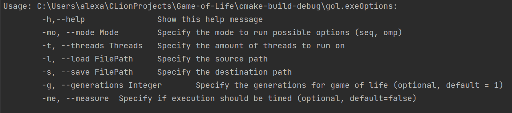
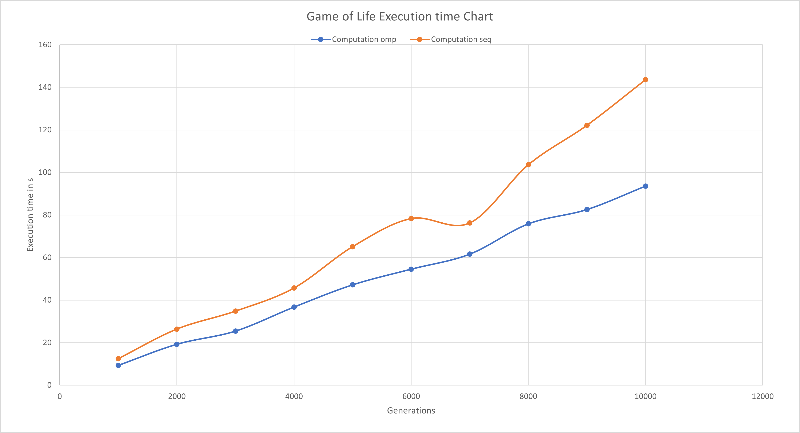

# Game of Life
A Sequential and Parallel Implementation of the 0 player game "Game of life" for the university course Advanced Programming

## Input file format
The input file needs to be in the form: 
width,height  
content as a matix(width, height)

An Example file can be found in the example folder

## Arguments

## Runtime 
